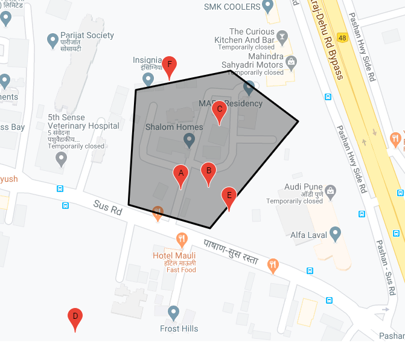

# geofence_test
A simple repository to check whether a point is within a geofence.



```php
require_once 'geofence_checker.php';
$geo_check = new GeofenceChecker();

$geofence_points = [
	[18.549009, 73.771049],
	[18.548044, 73.770981],
	[18.547842, 73.771706],
	[18.548746, 73.772491],
	[18.549170, 73.771889]
];

$geo_check->setGeofence($geofence_points);

// check pairs
// in
$A = [18.548162116567774,73.7714478984243];
$B = [18.5481824596542,73.77169466165367];
$C = [18.548701207538947,73.7717912211782];
// out of bounding
$D = [18.546956784372,73.77050912526909];
// in bounding but out of polgon
$E = [18.547975, 73.771881]; // intersections 0
$F = [18.549079, 73.771350]; // intersections 2


$geo_check->checkPoint($A, 'A');
$geo_check->checkPoint($B, 'B');
$geo_check->checkPoint($C, 'C');
$geo_check->checkPoint($D, 'D');
$geo_check->checkPoint($E, 'E');
$geo_check->checkPoint($F, 'F');

```
### Output
```
Point A within Bounding Box
Point A is INSIDE

Point B within Bounding Box
Point B is INSIDE

Point C within Bounding Box
Point C is INSIDE

Point D is OUTSIDE Bounding Box

Point E within Bounding Box
Point E is OUTSIDE

Point F within Bounding Box
Point F is OUTSIDE
```


* `test_geofence.php` checks whether points are in the fence or not.
* Points are obtained using `get_points.php` , which uses google maps. (API key required)
* Use `plot_on_map.php` , to visualize these points/geofences. (API key required)
* Replace YOUR_API_KEY in the script tag for `get_points.php` and `plot_on_map.php`

[Click here to get an API key for Google Maps](https://developers.google.com/maps/documentation/javascript/get-api-key)

[How the algorithm works](http://stackoverflow.com/questions/217578/how-can-i-determine-whether-a-2d-point-is-within-a-polygon)


